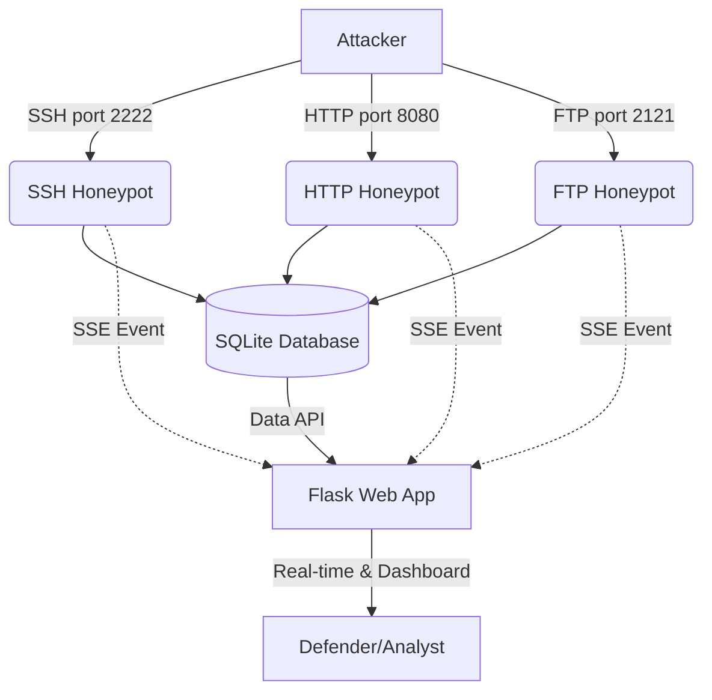

# CyberTrap Honeypot System


CyberTrap is a multi-protocol honeypot and real-time dashboard designed to attract, log, and analyze malicious network activity. It is built as an educational tool to study attacker behaviors and learn defensive programming techniques.

## Features

- 🐝 **Multi-Protocol Deception**: Emulates SSH, HTTP, and FTP services.
- 📊 **Real-Time Dashboard**: Monitor attacks as they happen via Server-Sent Events (SSE).
- 📈 **Interactive Analytics**: View statistics, timelines, and attack distributions.
- 💾 **Local Storage**: Automatically logs all interactions, payloads, and attacker IPs into an SQLite database.
- 📥 **Export Functionality**: Easily export attack logs as a CSV file for offline analysis.
- 🛠️ **Configurable**: Simple configuration system for toggling services and tweaking ports.

## Architecture



## Prerequisites

- Python 3.10 or higher
- pip (Python package installer)

## Installation

1. **Clone the repository:**
   ```bash
   git clone <repo_url>
   cd "final project"
   ```

2. **Install dependencies:**
   ```bash
   pip install -r requirements.txt
   ```

## Usage

Start the honeypot system and the web dashboard by running:

```bash
python app.py
```

Once running, open your browser and navigate to [http://localhost:5000](http://localhost:5000) to view the real-time dashboard.

## Testing the Honeypot

You can simulate attacks to test the honeypot functionalities locally:

- **SSH (Port 2222)**:
  ```bash
  ssh root@localhost -p 2222
  ```
  Try logging in with any random credentials. The honeypot will log the attempt.

- **HTTP (Port 8080)**:
  ```bash
  curl http://localhost:8080
  curl -X POST http://localhost:8080/login -d "username=admin' OR 1=1--"
  ```
  Visit it in a browser or use tools like `curl` to simulate web scanning, dirbusting, or injection attacks.

- **FTP (Port 2121)**:
  ```bash
  ftp localhost 2121
  ```
  Try basic FTP commands and dummy credentials to trigger logging.

## Project Structure

```
final project/
├── app.py               # Main entry point (Flask server & honeypots init)
├── config.py            # Configuration parameters
├── database.py          # SQLite interactions and logging functions
├── classifier.py        # Pattern-based attack classification & severity scoring
├── demo.py              # Scripted live-attack demo for presentations
├── requirements.txt     # Python dependencies
├── honeypots/           # Protocol emulator modules
│   ├── __init__.py
│   ├── ssh_honeypot.py
│   ├── http_honeypot.py
│   └── ftp_honeypot.py
├── static/              # Static assets (CSS, JS)
├── templates/           # HTML Jinja templates for the dashboard
└── README.md            # Project documentation
```

## How It Works

- **`app.py`**: Integrates the services and the Flask web dashboard, setting up logging, and exposing real-time Server-Sent Events endpoints for the front-end.
- **`database.py`**: Manages the local SQLite database to persist attack details cleanly and efficiently. Provides methods to retrieve aggregated data for charts.
- **`honeypots/`**: Contains the implementations of the mock servers using sockets or lightweight frameworks to intercept, parse, and log incoming attacker traffic without compromising the host machine.
- **Web Interface**: Built with HTML, CSS, JavaScript (often utilizing charting libraries), providing an accessible summary of the logged events.

## Security Notice

> [!WARNING]
> This system is built for **educational purposes only**. Running a honeypot on a public network can attract real, malicious traffic to your infrastructure. Never deploy this on critical systems without proper isolation (like a dedicated VM, Docker container, or strict firewall rules) as there may be unforeseen vulnerabilities in the emulation layers.

## Team Members

- [Student Name 1] (ID)
- [Student Name 2] (ID)

## License

This project is licensed under the MIT License.
